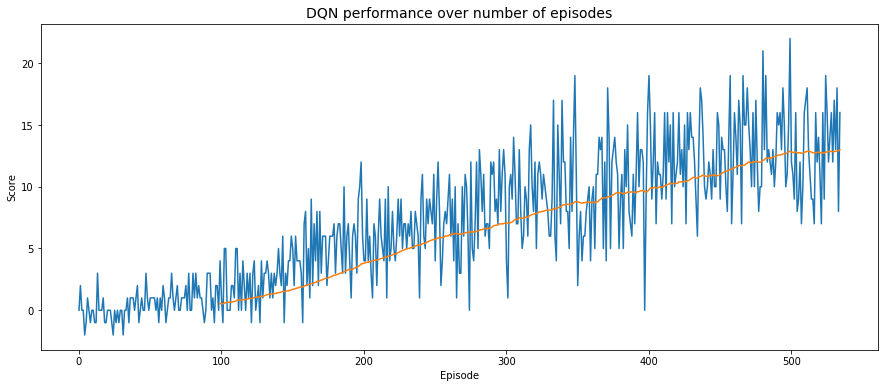

# Navigation with Deep Q-Network 

## Learning algorithm

In this project I applied the DQN algorithm to train an agent to navigate the Banana Collector square world. All I am about to mention regarding this algorithm comes from DeepMind's paper ["Human-level control through deep reinforcement learning"](https://storage.googleapis.com/deepmind-media/dqn/DQNNaturePaper.pdf), written by authors V. Mnih, K. Kavukcuoglu, D. Silver and others.

Two key features of this algorithm are Experience Replay and Fixed Q-Targets:

- **Experience Replay**: When the agent interacts with the environment, sequence experience tuples can be highly correlated. For this reason, instead of feeding our network with such sequences in order, we keep track of a replay buffer and use experience replay to sample from such buffer at random. This is expected to prevent action-values from oscillating or diverging.
- **Fixed Q-Targets**: In Q-Learning, we update a guess with a guess. This can potentially lead to harmful correlations. To avoid this, when computing the discounted Q-value of the next state, we use a vector **w<sup>-</sup>** whose weights belong to a separate target network that remains unchanged during the learning step. This gives us a more stable learning environment thanks to decoupling the target from the parameters.

### Hyperparameters
During training, I used an epsilon-greedy behaviour policy. The initial value of `epsilon` was `1.0`, linearly annealed to `0.1` at a decay rate of `0.995`.
The DQN agent's hyperparameters were the following:
```
BUFFER_SIZE = int(1e5)  # replay buffer size
BATCH_SIZE = 64         # minibatch size
GAMMA = 0.99            # discount factor
TAU = 1e-3              # for soft update of target parameters
LR = 5e-4               # learning rate 
UPDATE_EVERY = 4        # how often to update the network
```

### Q-network model architecture
I used a relatively simple neural network with 2 fully-connected hidden layers and 1 output layer. Both hidden layers were made of 64 units each, activated by a ReLU function. The output layer was made of of 4 units, i.e. the number of possible actions. No activation function was used in the output layer.

### Plot of Rewards


### Ideas for future work
Next ideas to explore to descrease the number of episodes needed to solve the environment:
- Different values of discount rate, learning rate and epsilon-decay rate.
- Different number of layers, units per layer and activation function
- Different algorithmic solutions, such as:
    - Double-DQN
    - Prioritized Experience Replay
    - Dueling DQN
    - Rainbow